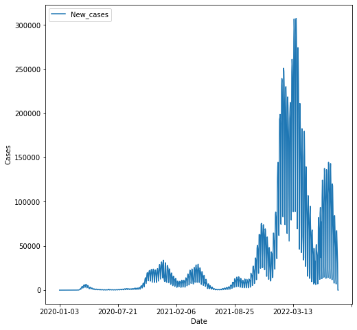

# Data_Science_Portfolio
Data Science Portfolio von Anmol Singh Bhardwaj

[Project #1: Data Analysis of covid cases in Germany](https://github.com/AnmolSinghBhardwaj/CovidDataAnalysis)
* Data from https://covid19.who.int/
* Analysis of covid cases and deaths

[Project #2: Breast Cancer Prediction](https://github.com/AnmolSinghBhardwaj/BreastCancer_Prediction)
* A classification modell wether a tumor is malignant (cancerous) or benign(non-cancerous).
* Data is from https://www.kaggle.com/datasets/yasserh/breast-cancer-dataset?resource=download
* The machine learning algorithm is a logistic regression
