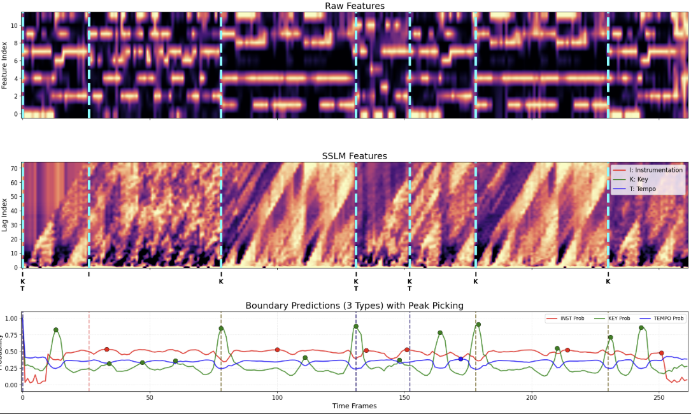
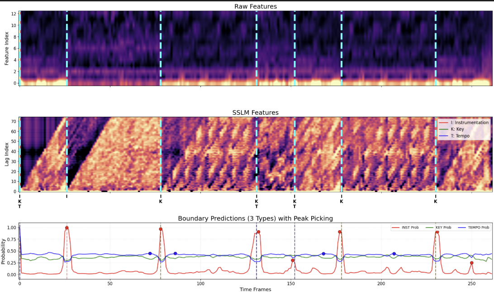
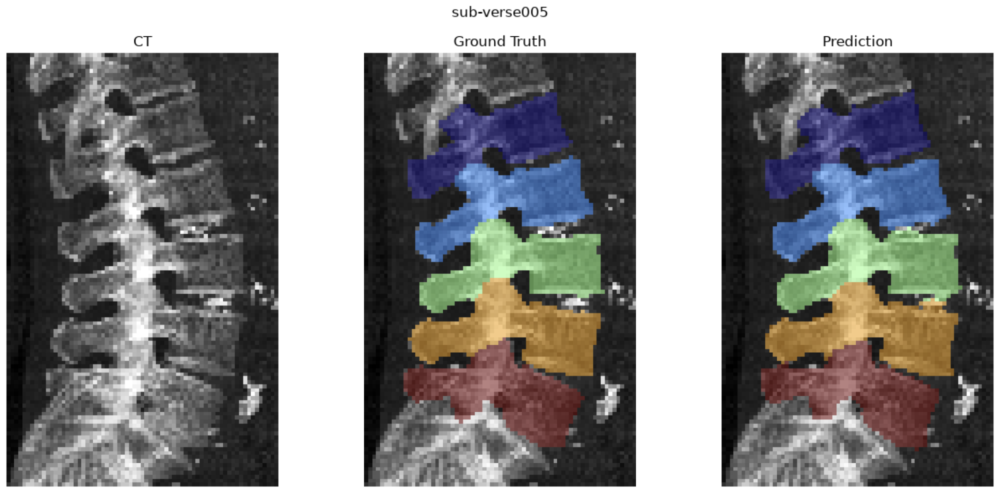
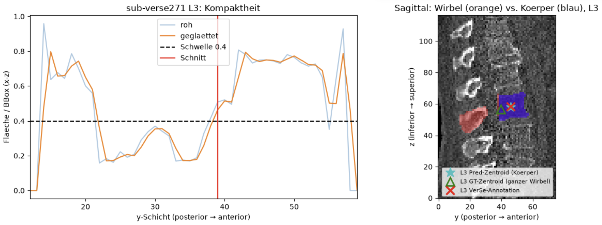

# Data Science Portfolio
Data Science Portfolio of Anmol Singh Bhardwaj

[Project #1 (Master Thesis): Music Segment Boundary Detection using Convolutional Neural Networks](https://github.com/AnmolSinghBhardwaj/cnn-based-music-segmentation-by-boundary-type)
* Automatic detection of instrument, key, and tempo changes in music tracks

* Development of a CNN with multi-output heads for different musical dimensions

* Integration of SMS-EMOA (evolutionary multi-objective optimization) to optimize input features for music boundary detection 

* Experimentation with raw features (MFCC, Chroma) vs. SSLM-enhanced features

* Implementation of weighted loss and negative sampling to improve rare boundary detection

* Evaluation on ~3000 songs, reporting precision, recall, and F1 per boundary type

* Framework built with Python, PyTorch, Pymoo, and Librosa

[Project #2: Lumbar Spine Segmentation from CT (L1–L5)](https://github.com/AnmolSinghBhardwaj/lumbar-spine-segmentation)
* End-to-end pipeline for lumbar spine CT: data harmonisation, 3D segmentation of the vertebrae L1–L5, vertebral body centroids and cross-dataset evaluation

* Unified loader for two public datasets (TotalSegmentator, VerSe) with differing orientations, voxel spacings, label conventions and scanners; systematic detection and handling of header and annotation anomalies

* Preprocessing: reorientation to RAS, resampling to 2 mm isotropic, fixed HU windowing, lumbar cropping and removal of stray label fragments

* Training of a 3D U-Net from scratch on patches with mixed precision and a Dice + cross-entropy loss (≈13 min on 2× T4 GPUs)

* Rule-based extraction of the vertebral body from each predicted vertebra via a compactness profile along the anterior–posterior axis, with centroids in world coordinates (RAS, mm)

* Evaluation in-domain (TotalSegmentator, Dice 0.89) and out-of-domain (VerSe, Dice 0.85), including failure analysis of level-shift errors at the field-of-view boundary

* Framework built with Python, PyTorch, MONAI, NiBabel and SciPy

[Project #3: Data Analysis of Chelsea's Premier League Campaigns from 2006 to 2018](https://github.com/AnmolSinghBhardwaj/EDA_Chelsea)

* Analysis of Chelsea's development from 2006 to 2018
* Observation of wins and losses over the years and the assumption of the reason behind them
* Comparison of home and away games 
* Evaluation of home and away games against 'big six' teams
* Data from https://www.kaggle.com/datasets/zaeemnalla/premier-league

[Project #4: Breast Cancer Prediction](https://github.com/AnmolSinghBhardwaj/BreastCancer_Prediction)
* A classification modell wether a tumor is malignant (cancerous) or benign(non-cancerous).
* Data is from https://www.kaggle.com/datasets/yasserh/breast-cancer-dataset?resource=download
* The machine learning algorithm is a logistic regression

